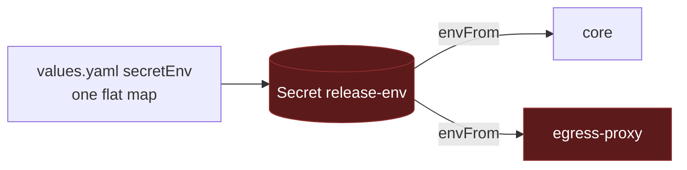
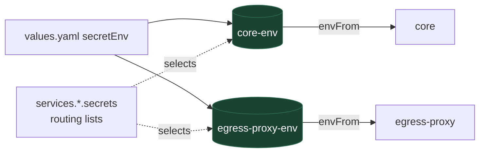

# One Secret per workload in the Helm chart

Stop handing every secret to every pod.

This is the implementation plan for the first, self-contained step of the
secretless work: make the Helm chart render one `Secret` per Deployment and
attach only that one. It needs no change to core, and it is a prerequisite for
per-workload identity, which lands separately. File and line citations are
against this tree, after the deployment-path removal that deleted the `qm` CLI,
the Fly, AWS, and Porter targets, and the web-ui and admin services. The
proposal for upstream is `adrs/helm-per-service-secrets.md`, sent on its own
stack.

## Context

The chart at `deploy/helm/` renders `values.yaml` `secretEnv` into a single
`Secret` named `<fullname>-env` and attaches it with an unconditional `envFrom`
to every Deployment it creates, which are core and egress-proxy[^helmenvfrom].
Both Deployments carry the whole map.

The consequence is that the egress-proxy pod, which reads two keys, holds
`ANTHROPIC_API_KEY`, `DATABASE_URL`, `CONNECTOR_SECRET_KEY`,
`SKILL_SIGNING_SECRET`, and the sandbox vendor keys as well. An egress-proxy
compromise is a database compromise and a model-billing compromise in one
step.

Nothing else routes these values any more. The deployment CLI that used to
carry a per-service secret spec went with the proprietary deployment paths, so
the chart's flat map is the only routing surface in the repository, and it
routes everything to everybody.

Non-secrets live in the same Secret: `PUBLIC_API_URL`, `ADMIN_GRANTS`,
`SANDBOX_BACKEND`, `DEPLOY_PROVIDER`, the apps domain, and
`AUTH_EMAIL_FROM`. They are there because `secretEnv` is the only per-release
map the chart offers that reaches every pod.



## Goals

- Each Deployment receives exactly the secrets its processes read, and nothing
  else. The egress-proxy pod stops holding the database, model, and sandbox
  credentials.
- The routing lives in the chart as data an operator can read and override.
- A change to one workload's secrets rolls only that workload.
- Existing releases upgrade with one rolling restart, and with a values change
  only for a key outside the shipped defaults.

## Non-goals

- Changing what any process reads. Core and the egress authz keep reading
  `process.env`; only the environment they are given shrinks.
- Per-service ServiceAccounts, projected tokens, or any identity change. Those
  are the next step and depend on this one.
- External Secrets Operator or any other carrier. This design decides which
  keys reach which pod; where the values come from is unchanged. An
  `ExternalSecret` per workload slots into the same shape later.
- Reconciling the routing with core's own boot-time spec list
  (`src/deployment/secret-schema.ts`). The chart carries its own table for now;
  rendering it from a single spec is a later reconciliation, and the secretless
  plan schedules it.

## Who reads what

The routing is derived from the code, not from the current `secretEnv`. Core
is `src/config.ts` and the modules it wires; egress-proxy is
`src/egress-authz-main.ts`.

| Deployment       | Hosts        | Secrets read                                                                                                                                                                                                                                                                                                                                                                                                                                                                                                                                                                                                                                                                                                    | Non-secrets currently in `secretEnv`                                                                                                     |
| ---------------- | ------------ | --------------------------------------------------------------------------------------------------------------------------------------------------------------------------------------------------------------------------------------------------------------------------------------------------------------------------------------------------------------------------------------------------------------------------------------------------------------------------------------------------------------------------------------------------------------------------------------------------------------------------------------------------------------------------------------------------------------- | ---------------------------------------------------------------------------------------------------------------------------------------- |
| **core**         | core, slack  | `CORE_SIGNING_SECRET`, `CAPABILITY_SECRET`, `PORTAL_IDENTITY_SECRET`, `CONNECTOR_SECRET_KEY`, `SKILL_SIGNING_SECRET`, `ANTHROPIC_API_KEY`, `OPENAI_API_KEY`, `OPENROUTER_API_KEY`, `MODEL_GATEWAY_API_KEY`, `DATABASE_URL`, `DATABASE_POOL_URL`, the sandbox vendor keys, `DEPLOY_APPS_SESSION_SECRET`, `DEPLOY_GATE_SECRET`, the seven `*_OAUTH_CLIENT_SECRET` values, `SLACK_BOT_TOKEN`, `SLACK_APP_TOKEN`, `SLACK_USER_TOKEN`, `SLACK_COPILOT_BOT_TOKEN`, `SLACK_SIGNING_SECRET`, `SECURITY_SCREEN_PROXY_TOKEN`, `RESEND_API_KEY`, and the harness credentials `ANTHROPIC_AUTH_TOKEN`, `CLAUDE_CODE_OAUTH_TOKEN`, `CLAUDE_AUTH_CREDENTIAL`, `CODEX_ACCESS_TOKEN`, and `CODEX_AUTH_CREDENTIAL`[^harnesscreds] | `PUBLIC_API_URL`, `ADMIN_GRANTS`, `SANDBOX_BACKEND`, `DEPLOY_PROVIDER`, `DEPLOY_APPS_DOMAIN`, `AUTH_EMAIL_FROM`, the two CA certificates |
| **egress-proxy** | egress authz | `CORE_SIGNING_SECRET`, `CAPABILITY_SECRET`; `DATABASE_URL` only when no core relay is configured, and the chart always wires one[^egressenv]                                                                                                                                                                                                                                                                                                                                                                                                                                                                                                                                                                    | none                                                                                                                                     |

Three things deserve a note.

- The core list is longer than the chart's `secretEnv` declares. The current
  template forwards any key an operator adds to the map[^secretrange], so a
  Slack-enabled release already carries `SLACK_BOT_TOKEN` and `SLACK_APP_TOKEN`
  through it, and a Modal-backed one carries `MODAL_TOKEN_ID` and
  `MODAL_TOKEN_SECRET`. The defaults have to list every secret name core reads,
  not just the handful the values file mentions, or those releases fail to
  upgrade. The list is core's runtime schema plus the reads outside
  it[^coresecrets], and those reads include the alternative harness
  credentials: a Claude subscription token or keychain credential instead of
  `ANTHROPIC_API_KEY`, and a ChatGPT token or keychain credential instead of
  `OPENAI_API_KEY`[^harnesscreds]. The first draft of this list missed those,
  which is why the render check does not trust the list alone.
- The egress-proxy authz reads `DATABASE_URL`, but only as the audit sink it
  falls back to when it has no core relay, and the chart wires `CORE_API_URL`
  on every non-core Deployment[^egressenv]. So the routed set is the two keys,
  and the database credential reaches one pod, not two.
- `PORTAL_IDENTITY_SECRET` is routed to one reader and written by none. Core
  verifies the signed identity header under it and the workload that used to
  mint it is gone[^identityheader]. The routing keeps the key where the verifier
  is; supplying a producer is the secretless plan's Phase B1, not this change.

## Proposed design

### Values shape

`secretEnv` keeps its shape: one flat map, the one place an operator types
values, so no value is entered twice. Routing is a list of key names per
declared service, shipped with defaults that encode the table above. The
defaults list every secret name the code reads, including the ones the chart's
`secretEnv` does not declare today (`SLACK_BOT_TOKEN`, the sandbox vendor
keys, `OPENAI_API_KEY`, `DEPLOY_APPS_SESSION_SECRET`, and the rest of the core
row); an empty or absent value is skipped, so listing them costs nothing and
routes them correctly once set.

```yaml
services:
  core:
    secrets:
      - CORE_SIGNING_SECRET
      - CAPABILITY_SECRET
      - PORTAL_IDENTITY_SECRET
      - CONNECTOR_SECRET_KEY
      - SKILL_SIGNING_SECRET
      - ANTHROPIC_API_KEY
      - OPENAI_API_KEY
      - OPENROUTER_API_KEY
      - MODEL_GATEWAY_API_KEY
      - DATABASE_URL
      - DATABASE_POOL_URL
      - DATABASE_POOL_CA_CERT
      - DATABASE_CA_CERT
      - E2B_API_KEY
      - MODAL_TOKEN_ID
      - MODAL_TOKEN_SECRET
      - SMOLMACHINES_TOKEN
      - AGENT37_API_KEY
      - DEPLOY_APPS_SESSION_SECRET
      - DEPLOY_GATE_SECRET
      - GOOGLE_OAUTH_CLIENT_SECRET
      - DROPBOX_OAUTH_CLIENT_SECRET
      - LINEAR_OAUTH_CLIENT_SECRET
      - SLACK_OAUTH_CLIENT_SECRET
      - NOTION_OAUTH_CLIENT_SECRET
      - GITHUB_OAUTH_CLIENT_SECRET
      - X_OAUTH_CLIENT_SECRET
      - SLACK_BOT_TOKEN
      - SLACK_APP_TOKEN
      - SLACK_USER_TOKEN
      - SLACK_COPILOT_BOT_TOKEN
      - SLACK_SIGNING_SECRET
      - ANTHROPIC_AUTH_TOKEN
      - CLAUDE_CODE_OAUTH_TOKEN
      - CLAUDE_AUTH_CREDENTIAL
      - CODEX_ACCESS_TOKEN
      - CODEX_AUTH_CREDENTIAL
      - SECURITY_SCREEN_PROXY_TOKEN
      - RESEND_API_KEY
      - PUBLIC_API_URL
      - ADMIN_GRANTS
      - SANDBOX_BACKEND
      - DEPLOY_PROVIDER
      - DEPLOY_APPS_DOMAIN
      - AUTH_EMAIL_FROM
  egress-proxy:
    secrets:
      - CORE_SIGNING_SECRET
      - CAPABILITY_SECRET
```

A list rather than a map, because the values already live in `secretEnv` and
a second map would invite typing them twice. Helm replaces a list wholesale on
override, which is the right semantics for a routing table: an operator who
overrides `services.egress-proxy.secrets` states the whole set.

A name in `secretEnv` with a non-empty value that no enabled workload lists is
a render failure naming the key. That catches the habit this change is
removing: adding a key to `secretEnv` and expecting it to appear everywhere.
It also means an operator who has been carrying a non-secret setting through
`secretEnv` sees each such key named at `helm upgrade`
and moves it, one line each, to `env`, to `services.<name>.env`, or to the
service's `secrets` list. A listed name with an empty or absent value is
skipped, as today, so the defaults can list optional keys without forcing
them.

Each service also gains `services.<name>.envFrom`, the scoped form of the
top-level `envFrom` list. The top-level list stays and keeps its meaning,
which is shared by every Deployment[^envfromvalue]; it is the operator's
escape hatch, and the values file says so.

### Templates

A named template, `qm.workloadSecret`, takes `(dict "root" $ "service"
$name)` and renders one `Secret` named `<fullname>-<service>-env` containing
that service's list, filtered to non-empty values. `templates/secret.yaml` ranges over the rendered
Deployments and includes it once each. The `OIDC_*` aliases the template used
to render go with the sign-in front door they served, so nothing in the chart
aliases one `secretEnv` key onto another any more and the renderer checks each
non-empty input against the union of the enabled routing lists and nothing
else.

`templates/deployment.yaml` attaches `<fullname>-<service>-env` by
`secretRef`, then the workload's own `envFrom`, then the shared top-level list.
Kubernetes resolves a key that appears in more than one `envFrom` entry to
the last one, so the shared list wins over the chart's Secret, which is
today's order as well[^envfromvalue]. Nothing else from `secretEnv` reaches
the pod.

The `checksum/secret-env` annotation includes `qm.workloadSecret` with the
same `dict` and hashes that, rather than the whole `secret.yaml`
render[^helmchecksum]. Including the file would hash every workload's Secret
and roll every pod on any change, which is what happens today; including the
named template for this service hashes this service's Secret
only. Rotating `ANTHROPIC_API_KEY`, which only core's Secret carries, rolls
core and nothing else; rotating `CORE_SIGNING_SECRET` rolls both, because both
read it.



### What the rendered egress-proxy Secret contains afterwards

With the defaults, the egress-proxy pod's Secret holds `CORE_SIGNING_SECRET`
and `CAPABILITY_SECRET`. It no longer holds `ANTHROPIC_API_KEY`,
`DATABASE_URL`, `CONNECTOR_SECRET_KEY`, `SKILL_SIGNING_SECRET`,
`PORTAL_IDENTITY_SECRET`, or any sandbox vendor key. That is the acceptance
test, and it is checked in CI.

### Verification

The repository has no chart test today; `scripts/deploy-helm.sh` packages and
installs, and nothing renders the chart in CI[^helmci]. This change adds a
render check that any contributor can run:

```sh
helm lint deploy/helm
helm template qm deploy/helm -f deploy/helm/ci/values.yaml > /tmp/render.yaml
```

with assertions over the render: exactly one `Secret` per enabled
Deployment; each Secret's keys equal to the table above for a values file that
sets every routed key; the egress-proxy Secret free of the keys above; every
Deployment's `envFrom` carrying exactly one chart-rendered `secretRef` and it
its own; and a values file with an unrouted key failing with the key's name in
the message. Fixtures cover the alternative harness credential paths
(`CLAUDE_CODE_OAUTH_TOKEN` and `CODEX_ACCESS_TOKEN` set, the API keys unset)
and assert core's Secret carries them.

Comparing the render to a hand-maintained table cannot catch a name missing
from both, so a second check derives the expected set from the code. It scans `src/`
for member reads of the form `env.NAME` and
`process.env.NAME`, because core reads its environment through a function
parameter named `env` rather than `process.env`[^envparam], and for
string-valued env-name fields such as `clientSecretEnv`. Computed reads
through `process.env[name]` are invisible to a scan and are listed by
hand[^computedreads]. Every name found that matches `TOKEN`, `SECRET`, `KEY`,
`PASSWORD`, or `CREDENTIAL` must appear in some routing list or in a short,
explicit exclusion list of names that match the pattern and are not secrets
(`MAX_CONTEXT_TOKENS`, `EGRESS_TOKENLESS`, `MODEL_GATEWAY_API_KEY_HEADER`) or
are minted at runtime and never deployed (`AGENT_CREDENTIAL_TOKEN`,
`OPENCODE_BRIDGE_SECRET`). A new credential read fails that check until
someone routes it.

Disabling a service must remove its Secret and its references, and an unrelated
unused key in any values file must fail.
The assertions live in a shell test next to the chart and run in the existing
`Lint` job, which already checks the tree's formatting and is the job that
touches chart files.

## Migration

Chart `version` moves to the next minor[^chartver]. The upgrade path
for an existing release:

1. `helm upgrade`. If every non-empty key in `secretEnv` is one the defaults
   route, which covers every secret name the code reads, there is no values
   change. Every Deployment's checksum annotation changes, because its Secret
   is new, so every pod rolls once, and each comes back with a strict subset
   of what it had.
2. If the operator had put anything else into `secretEnv`, such as a
   non-secret setting, the render fails and names each such key.
   They move each one to `env`, to `services.<name>.env`, or to the service's
   `secrets` list, and upgrade again. That is a values change, it is
   one line per key, and it happens at render rather than at runtime.
3. The old `<fullname>-env` Secret is removed by Helm as part of the upgrade,
   since it is no longer in the render.

The probes will not catch a lost key, so the render check is the safety net
and not the roll. Only core has an HTTP health path; egress-proxy uses a
`tcpSocket` probe[^probes], and every process treats a
missing key as optional at runtime: the egress authz falls back to an
in-memory audit sink[^egressenv]. A missing key is a quiet regression, which is why the
render check compares each Secret's keys to the table rather than checking
only that the pods come up.

A downgrade is `helm rollback`, which restores the single Secret and the
`envFrom` on every pod.

## Alternatives considered

**A `secretEnv` map per service.** `services.<name>.secretEnv` with the values
inside. Simplest template, but `CORE_SIGNING_SECRET` would be typed twice, and
a rotation that misses one copy is a signature-mismatch outage. Rejected in
favor of one value store plus routing.

**Render the routing from core's own spec list.** The right end state, and the
reason this document calls the lists "for now". It needs
`src/deployment/secret-schema.ts` widened until it names every secret core
reads, a service field on each entry, and a Kubernetes emitter — none of which
exists, and the list knows nothing about egress-proxy. That is the
reconciliation the secretless plan schedules as its first phase; this change
should not wait for it.

**Keep one Secret and use `env.valueFrom.secretKeyRef` per key.** Same
per-pod outcome, one Secret to manage, but every key becomes a template entry,
the checksum cannot distinguish workloads, and RBAC or an `ExternalSecret`
cannot later scope the Secret itself. Rejected.

**Move the non-secrets to `services.<name>.env` in the same change.** Cleaner,
and the defaults do not stop an operator doing it. Doing it for them means an
upgrade that changes values files, which this change deliberately avoids. Left
as a recommendation in the values file's own comments and in the chart's
README.

## Risks

| Risk                                                                       | Mitigation                                                                                                                                                                                                   |
| -------------------------------------------------------------------------- | ------------------------------------------------------------------------------------------------------------------------------------------------------------------------------------------------------------ |
| The table misses a read and a pod loses a key it needs                     | The render check compares each Secret's keys to the table; the probes do not catch it, so the check gates the merge; `helm rollback` restores the previous state in one command                              |
| A release carries a key through `secretEnv` that the defaults do not route | The render fails naming the key before anything rolls; secret names the code reads are all routed by default, so this bites non-secret settings, each a one-line move                                        |
| The chart's routing drifts from what the code reads                        | The lists are data in one file, next to the table in this document, and the code scan fails on a credential read that no list routes                                                                         |
| The one-time roll interrupts in-flight agent turns                         | Core has no PodDisruptionBudget or other disruption protection on Kubernetes; schedule the upgrade like any other core roll                                                                                  |
| The shared `envFrom` is used to reintroduce a map every pod receives       | It keeps that meaning on purpose and the values file says so; `services.<name>.envFrom` is the scoped form; the render check asserts each Deployment carries exactly one chart-rendered `secretRef`, its own |

## Open questions

None. The routing table is derived from the code and the render check pins
it.

## References

[^helmenvfrom]: `deploy/helm/templates/secret.yaml` renders every `secretEnv` value into one `Secret`; `deploy/helm/templates/deployment.yaml` attaches it by `secretRef` inside an `envFrom` that every rendered Deployment receives. The two Deployments are core and egress-proxy.

[^egressenv]: `src/egress-authz-main.ts:233` (`CAPABILITY_SECRET`), `:234` (`DATABASE_URL`), `:236` (`CORE_SIGNING_SECRET`); `:243` uses the core relay when `CORE_API_URL` and `CORE_SIGNING_SECRET` are set, the Postgres sink when only `DATABASE_URL` is, and an in-memory sink otherwise. `deploy/helm/templates/deployment.yaml:50` wires `CORE_API_URL` on every non-core Deployment.

[^identityheader]: `verifyPortalIdentity` runs in core at `src/api/server.ts:293`. The only remaining minter is core's published-app viewer path (`src/api/routes/deployments.ts:513`), which signs under a per-deployment derived key rather than `PORTAL_IDENTITY_SECRET`.

[^secretrange]: `deploy/helm/templates/secret.yaml:10` — `range $k, $v := .Values.secretEnv` renders every non-empty key, declared in `values.yaml` or not.

[^coresecrets]: `src/deployment/secret-schema.ts:29` lists the names core validates at boot; `MODEL_GATEWAY_API_KEY`, `DEPLOY_APPS_SESSION_SECRET`, `SECURITY_SCREEN_PROXY_TOKEN`, the Slack values, and the four undeclared `*_OAUTH_CLIENT_SECRET` names (`src/connectors/oauth.ts`, `clientSecretEnv`) are read by core and appear in no list.

[^harnesscreds]: `src/config.ts` reads `CLAUDE_CODE_OAUTH_TOKEN` and `ANTHROPIC_AUTH_TOKEN` from the Claude harness environment, `CODEX_ACCESS_TOKEN` from the Codex one, and `CODEX_AUTH_CREDENTIAL` and `CLAUDE_AUTH_CREDENTIAL` in `loadConfig`; `src/harness/claude-harness.ts:98` and `:100` pass the two Claude tokens to the child, and `src/harness/codex-harness.ts:234` passes `CODEX_ACCESS_TOKEN`. `src/slack/config.ts:65` and `:66` read `SLACK_USER_TOKEN` and `SLACK_COPILOT_BOT_TOKEN`.

[^envparam]: `src/config.ts` — `loadConfig(env = process.env)`; the reads below it are `env.NAME`, not `process.env.NAME`.

[^computedreads]: `src/harness/opencode-plugin.ts:48` reads `OPENCODE_BRIDGE_URL` and `OPENCODE_BRIDGE_SECRET` by name, the latter minted per run at `src/harness/opencode-harness.ts:753`.

[^probes]: `deploy/helm/templates/deployment.yaml` — an HTTP probe only when the service sets `healthPath`, otherwise `tcpSocket`; `deploy/helm/values.yaml` sets `healthPath` on core alone.

[^envfromvalue]: `deploy/helm/values.yaml:21` — `envFrom: []`, appended after the chart's own `secretRef` in `deploy/helm/templates/deployment.yaml`.

[^helmchecksum]: `deploy/helm/templates/deployment.yaml` — the annotation hashes the whole `secret.yaml` render, so any value change rolls every Deployment.

[^helmci]: `.github/workflows/cicd.yml` has no job that runs `helm`; `scripts/deploy-helm.sh:32` packages and `:38` installs, with no render assertion.

[^chartver]: `deploy/helm/Chart.yaml` — the chart's `version`.
