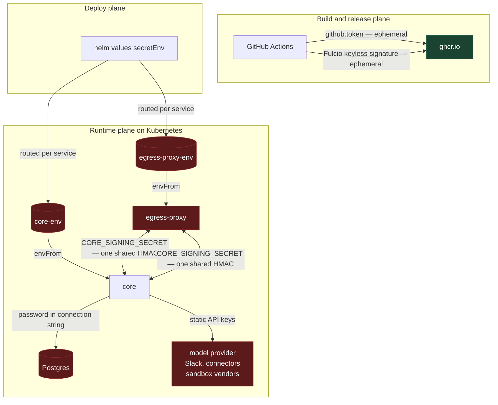
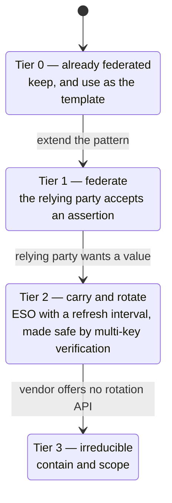
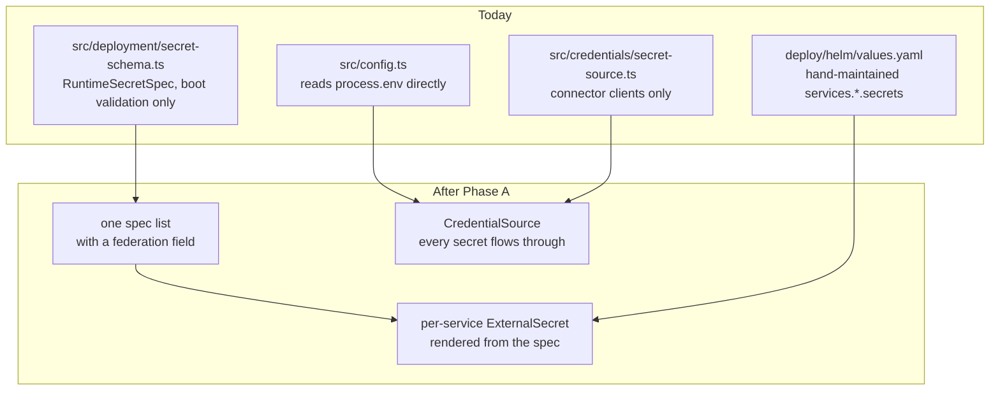
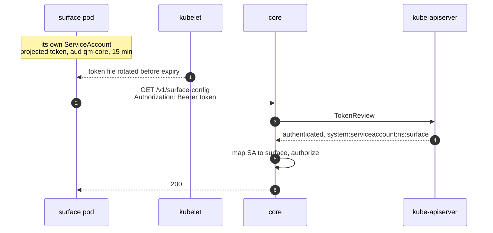
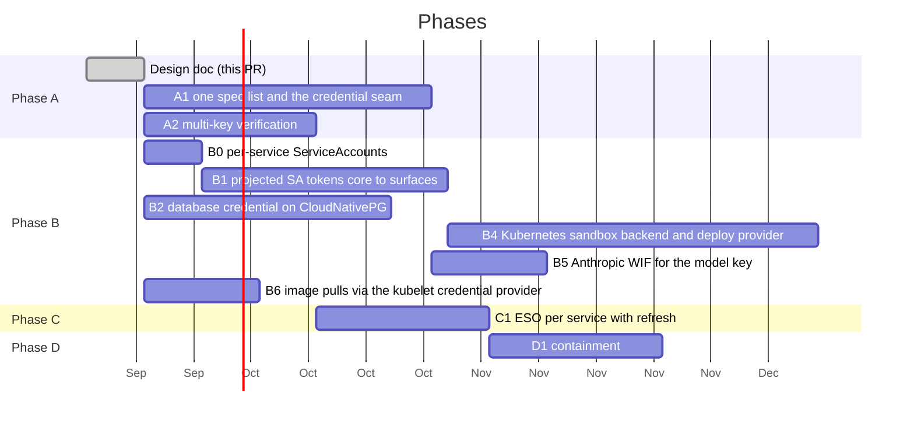

# Secretless QM

Replacing long-lived static secrets with federated, short-lived credentials.

This is the implementation plan: the full inventory, the mechanism analysis, and
the phasing. File and line citations are against this tree, after the
deployment-path removal that deleted the `qm` CLI and the Fly, AWS, and Porter
targets; `src/config.ts` and `src/wiring.ts` are cited by symbol rather than by
line. The proposal for upstream is `adrs/secretless-credentials.md`, sent on its
own stack, the same argument at proposal length. Keep the two in step when
findings change.

This plan stacks on
[`helm-per-service-secrets.md`](./helm-per-service-secrets.md), which splits
the chart's one shared `Secret` into one per workload with a routing list per
service. Everything below assumes that has landed.

## Context

QM deploys into an operator's own cluster and runs as a small fleet of services
that talk to each other, to Postgres, to a model provider, and to a set of
third-party APIs. Almost all of that trust is carried by static secrets: values
minted once by a human and injected as process environment for the life of the
deployment.

The deployment this plan is for is **Kubernetes**, through the Helm chart at
`deploy/helm/`, which renders two workloads: core and egress-proxy. The bar is: workload identity federation wherever a
relying party accepts an assertion, External Secrets Operator (ESO) everywhere
else, and in every case rotation that runs without a human.

There is no deployment CLI any more, so there is no second declaration list, no
`.env.example` consumer, and no deploy-side secret routing outside the chart.
The only list core keeps is `CORE_SECRET_SPECS`, which validates at
boot[^coresecretspecs] and reaches nothing on the deploy side. The chart's
`secretEnv` map and its per-service routing lists are the whole deploy-side
surface, and they are typed by hand. That gap shapes Phase A.

Several secrets core reads appear in neither list: `MODEL_GATEWAY_API_KEY`[^gateway],
`DEPLOY_APPS_SESSION_SECRET`[^deployapps], `SECURITY_SCREEN_PROXY_TOKEN`, four
connector client secrets the OAuth layer reads[^undeclaredoauth], and two that
only exist on Kubernetes: `imagePullSecrets` and the ingress TLS key. Of all of
them, only the TLS key expires on its own, because cert-manager rotates it; the
rest do not.

The build plane is already in better shape than the runtime plane. Image pushes
use the per-job `github.token`, and images are signed keylessly with Fulcio and
the job's own OIDC identity[^release]. That is the pattern this document
extends.

A note on vocabulary. "OIDC" already appears throughout this codebase meaning
_human_ sign-in: connector OAuth, and whatever identity source sits in front of
the deployment. This document uses **WIF** (workload identity federation) for
the machine-to-machine case to keep the two apart. They share a protocol and
share nothing else.

## Goals

- Eliminate every static secret that a supported identity provider can replace
  with a short-lived, audience-scoped, automatically-rotated credential.
- Where federation is not available, carry the secret through ESO with a
  refresh interval, and make the application safe to rotate under: no
  signature-mismatch outage, no invalidated sessions, no undecryptable rows.
- Make the residual set explicit, small, and contained, and say plainly which
  entries can never meet the rotation bar.
- Build one credential seam that every path flows through, so later work has a
  single place to change.

## Non-goals

- Rewriting how _user_ sign-in works. Core verifies a signed identity header and
  connector OAuth stays as it is; what mints that header is outside this design,
  and B1 says what it must satisfy.
- Changing how credentials are materialized into agent sandboxes. That surface
  has its own acknowledged limitations[^security] and its own broker-delivery
  path, which this design reuses but does not redesign.
- Adding a new secrets product. ESO is not a new product; it is the standard
  carrier on Kubernetes, and this design depends on it.
- Inventing federation where no vendor offers it. Slack does not federate and
  neither does OpenRouter; those are contained, not removed. Anthropic and OpenAI
  both do, which is Phase B5.

## Where the secrets are today



The one green node is reached with ephemeral, federated credentials. Every
other path rests on a value a human minted that does not expire.

### The Helm chart, after the per-workload split

The worst finding in the first draft of this plan was that the chart rendered
`secretEnv` into one `Secret` and attached it to every Deployment, so every pod
held the database and model credentials. That is fixed by the per-workload
split[^split], which lands before this plan and which this plan does not repeat.
What the split leaves for the phases below:

- The values are still static and still typed into `secretEnv` by hand. The
  split decides which pod gets a value, not where the value comes from.
- The routing lists in `services.<name>.secrets` are maintained by hand, and
  with the CLI gone there is no other list to render them from. A1 gives them
  one.
- Two reads the split's routing table surfaced stay in the inventory:
  egress-proxy reads `CAPABILITY_SECRET` and `CORE_SIGNING_SECRET` (and
  `DATABASE_URL` only as a fallback audit sink the chart never leaves it
  with), and core reads `DEPLOY_APPS_SESSION_SECRET`, which no declaration
  list mentions.
- Per-workload identity in Phase B1 would have bought nothing while every
  workload held every secret. That is why the split lands first.

### The service-to-service case

`CORE_SIGNING_SECRET` is a single symmetric HMAC key shared by core and _every_
caller — the egress proxy, and any surface or integration the deployment puts in
front of core. A caller reads it from process environment and signs every core
call with it[^chassis].

The consequences are structural, not hypothetical:

- Verification is symmetric, so any holder can forge any other holder's
  requests. A compromised `egress-proxy` container can sign as any surface.
- The signature carries no caller identity[^sourceauth]. Core cannot tell which
  caller called it, only that _a_ holder did.
- Rotation is a fleet-wide atomic event. There is no overlap window, because
  there is one key and one value.

`PORTAL_IDENTITY_SECRET` has the same shape in the same direction, minus a
producer. Core verifies a signed user identity carried in
the `x-portal-identity` header[^portalverify], and the portal that used to mint
it has been removed with the rest of the proprietary deployment paths. It is a
genuinely distinct key — core refuses to start in production if it is unset or
equal to `CORE_SIGNING_SECRET` or `CAPABILITY_SECRET`[^portalguard] — but it is
still symmetric, still shared with whatever is put in front of core, and still
rotated atomically — and since the portal's removal nothing signs that header
with it. The verifier is the
seam a future identity source at the ingress has to satisfy, which is why B1
treats filling that gap as part of its work rather than as someone else's.

### The rotation trap

Six secrets are symmetric keys verified against exactly one value. Call them
the **single-value set**: `CORE_SIGNING_SECRET`, `CAPABILITY_SECRET`,
`PORTAL_IDENTITY_SECRET`, `SKILL_SIGNING_SECRET`, `DEPLOY_APPS_SESSION_SECRET`,
and `CONNECTOR_SECRET_KEY`. Later phases refer to this set by name; it shrinks
as B1 deletes the first three.

ESO rotating the Kubernetes Secret and a reloader rolling the pods gives a
window in which core verifies with the new key while a surface still signs with
the old one, or the reverse. For the HMACs that is a signature-mismatch outage.
For the cookie key it invalidates every session. For `CONNECTOR_SECRET_KEY` it
makes every stored connector credential undecryptable. So ESO alone cannot meet
the rotation bar for this family; the application has to change first.

Two mechanics compound it. `loadConfig` snapshots `process.env` at
boot[^loadconfig], so a rotated value is invisible to a running pod until it
restarts. And the chart's `checksum/secret-env` annotation covers only its own
rendered Secret[^helmchecksum], not one ESO manages, so a rotation does not roll
the pods on its own.

### Full inventory

Tiers are defined in the next section.

| Secret                                                                                                           | Where it lives                | Today                                                                                                                                                | Tier |
| ---------------------------------------------------------------------------------------------------------------- | ----------------------------- | ---------------------------------------------------------------------------------------------------------------------------------------------------- | ---- |
| GHCR push                                                                                                        | `release-package.yml`         | `github.token`, per-job                                                                                                                              | 0    |
| Cosign signing key                                                                                               | `release-package.yml`         | keyless, Fulcio + OIDC                                                                                                                               | 0    |
| Ingress TLS key                                                                                                  | `values.yaml` `clusterIssuer` | cert-manager issues and rotates                                                                                                                      | 0    |
| `CORE_SIGNING_SECRET`                                                                                            | core, egress-proxy            | shared static HMAC                                                                                                                                   | 1    |
| `PORTAL_IDENTITY_SECRET`                                                                                         | core                          | static HMAC, verified by core and minted nowhere since the portal was removed                                                                        | 1    |
| `DATABASE_URL`                                                                                                   | core                          | static password, no rotation path                                                                                                                    | 1    |
| `imagePullSecrets`                                                                                               | `values.yaml`                 | PAT in a `dockerconfigjson` Secret on private forks; kubelet credential provider removes it                                                          | 1    |
| `ANTHROPIC_API_KEY`                                                                                              | core                          | static vendor key; Anthropic WIF is GA                                                                                                               | 1    |
| `OPENAI_API_KEY`                                                                                                 | core                          | static vendor key; OpenAI WIF is GA                                                                                                                  | 1    |
| `CONNECTOR_SECRET_KEY`                                                                                           | core                          | static encryption key, one value                                                                                                                     | 2    |
| `CAPABILITY_SECRET`                                                                                              | core, egress-proxy            | static HMAC, one value                                                                                                                               | 2    |
| `SKILL_SIGNING_SECRET`                                                                                           | core                          | static HMAC, one value                                                                                                                               | 2    |
| `DEPLOY_APPS_SESSION_SECRET`                                                                                     | core                          | static cookie key, declared by no list                                                                                                               | 2    |
| `DEPLOY_GATE_SECRET`                                                                                             | core                          | static HMAC behind per-app subdomains, one value                                                                                                     | 2    |
| `DATABASE_POOL_URL`                                                                                              | core                          | must carry the same credentials as `DATABASE_URL`                                                                                                    | 2    |
| `OPENROUTER_API_KEY`                                                                                             | core                          | rotatable through its management-keys API; root in the rotation Job                                                                                  | 2    |
| `MODEL_GATEWAY_API_KEY`                                                                                          | core                          | static bearer, declared by no list                                                                                                                   | 3    |
| `SLACK_BOT_TOKEN`                                                                                                | durable store                 | Slack token rotation, opt-in; needs refresh handling in the installation store                                                                       | 2    |
| `SLACK_APP_TOKEN`                                                                                                | durable store                 | encrypted at rest, no vendor rotation API                                                                                                            | 3    |
| `SLACK_SIGNING_SECRET`                                                                                           | core, env only                | no stored path, no vendor rotation API                                                                                                               | 3    |
| `E2B_API_KEY`, `MODAL_TOKEN_*`, `SMOLMACHINES_TOKEN`, `AGENT37_API_KEY`                                          | core                          | dashboard-minted; moot on this path once B4 lands                                                                                                    | 3    |
| `SECURITY_SCREEN_PROXY_TOKEN`                                                                                    | core                          | static bearer to a third-party screen                                                                                                                | 3    |
| `RESEND_API_KEY`                                                                                                 | core                          | rotatable through Resend's API; root in the rotation Job; the invitation mailer captures it at construction, so restart-required until A1 reaches it | 2    |
| `GOOGLE_/DROPBOX_/LINEAR_OAUTH_CLIENT_SECRET`                                                                    | core                          | ESO-carried; human-rotated at the IdP, propagates restart-free; PKCE public client removes it where the IdP permits                                  | 2    |
| `SLACK_OAUTH_CLIENT_SECRET`, `NOTION_OAUTH_CLIENT_SECRET`, `GITHUB_OAUTH_CLIENT_SECRET`, `X_OAUTH_CLIENT_SECRET` | core                          | same as above, and declared by no list                                                                                                               | 2    |

The "where it lives" column is the Helm chart after the per-workload
split[^split].

## The tiering



**Tier 1 — federate.** The relying party accepts a signed assertion in place of a
secret. The secret is deleted outright: no value exists to store, leak, or
rotate.

**Tier 2 — carry and rotate.** The relying party wants a value, but the value
can be minted or held somewhere with an audit trail and delivered short-lived.
The carrier is an `ExternalSecret` per service with a `refreshInterval`, whose
`SecretStore` authenticates to the cloud secret manager through IRSA, EKS Pod
Identity, GKE Workload Identity, or Azure Workload Identity — no static
credential for the store itself. Automatable rotation requires the multi-key
verification in Phase A first.

**Tier 3 — irreducible.** The vendor mints the credential in a dashboard and
offers no API to rotate it. Keep it out of process environment, deliver it
through the egress-proxy broker path where the consumer is an agent, and scope
it as narrowly as the vendor allows. Earlier revisions leaned on a `qm doctor`
age report as this tier's ceiling; that command went with the CLI, so nothing
reports age today and the doc should say so rather than imply more.

The success metric is the size of Tier 3 after the work, not the number of
mechanisms introduced.

## Proposed design

### Phase A: the seam, and safe rotation

Two pieces of groundwork, both prerequisites for everything after them.

**A1: build the seam that does not exist yet.** There are two candidate
chokepoints and neither is universal:

| Candidate                                                  | Actual reach                                                                                                                                                                                                                           |
| ---------------------------------------------------------- | -------------------------------------------------------------------------------------------------------------------------------------------------------------------------------------------------------------------------------------- |
| `CORE_SECRET_SPECS` (`src/deployment/secret-schema.ts:29`) | Boot-time validation only. It names a subset of what core reads and nothing on the deploy side consumes it.                                                                                                                            |
| `SecretSource` (`src/credentials/secret-source.ts`)        | Connector OAuth clients only[^secretsource]. Core's own secrets never pass through it — `CORE_SIGNING_SECRET`, `CONNECTOR_SECRET_KEY`, `SKILL_SIGNING_SECRET`, `DATABASE_URL` and the model keys are read straight from `process.env`. |

So A1 widens the boot-time list until it names every secret core reads, widens
`SecretSource` until core reads its own secrets through it, and gives that one
list a Kubernetes emitter. The per-workload split gave the chart a
hand-maintained routing list per service; A1 renders those lists, and later the
per-service `ExternalSecret`s, from the spec instead of maintaining them by
hand. Until the seam emits something the chart consumes, marking a spec
federated reaches nothing.



The runtime interface gains expiry:

```ts
export interface CredentialSource {
  get(name: string): Promise<{ value: string; expiresAt: number } | undefined>;
}
```

`createEnvSecretSource` becomes an implementation of it. The seam reads from a
**file-mounted Secret** rather than `envFrom`: the kubelet updates a mounted
Secret file in place, while environment variables never change after the
process starts. That is the Kubernetes rotation-without-restart primitive, it
generalizes to every value core reads through the seam, and it removes the
reloader from the risk table for those entries.

The seam selects its source at boot: a projected token file present means
federation, otherwise the environment. The `dev-instance` launcher reads shell
environment, `dev.env`, and `.env` only, so local development degrades to the
static path with no cluster and no cloud identity, which is what the dual-read
rule requires anyway.

**A2: key rollover with prepare, activate, retire.** The application change
that makes rotation safe. The naive form — each verifier accepts current plus
previous and signs with the first — is not enough. It handles an old signature
reaching an updated verifier; it does not handle a new signature reaching a
verifier that has not updated yet. A caller that has refreshed to `[K1, K0]`
signs with `K1`; a core replica still on `[K0, K−1]` cannot verify it. The same
ordering breaks cookie verification between replicas and leaves a row encrypted
by an updated writer unreadable by an older reader. File-mounted delivery
changes how instances receive keys, not the order in which they do.

So the active producing key is distinct from the accepted set, and rollover is
three steps. **Prepare**: distribute the new key into every instance's accepted
set while every producer keeps using the old one — safe in any order, because
nothing signs with the new key yet. **Activate**: switch producers to the new
key only after every consumer holds it, on a generation counter each instance
reports and the rotation Job waits for, or on an explicitly justified rollout
barrier such as a full rolling restart with the accepted set already updated.
**Retire**: drop the old key from accepted sets only after everything it
produced has expired or been migrated — for HMAC tokens their TTL, for cookies
the session lifetime, and for `CONNECTOR_SECRET_KEY` every stored row
re-encrypted under the new key id, including rows in retained backups, which
outlive the live table.

Acceptance test: refresh a producer before a verifier, in both directions, then
roll back mid-rotation. The scheme passes only if every ordering verifies.

The fallback read path — federated attempted, static accepted — is instrumented
in A1 to report when it fires. Removing a fallback needs evidence nothing uses
it, and nothing in the tree reports that today.

### Phase B1: per-workload identity

Replace the shared HMAC with a per-workload assertion that core verifies without
a shared key. The workloads are core and egress-proxy, plus whatever surface the
deployment puts in front of core.

| Substrate      | Mechanism                                                                                                                                                                                                                                                                     | Secret material |
| -------------- | ----------------------------------------------------------------------------------------------------------------------------------------------------------------------------------------------------------------------------------------------------------------------------- | --------------- |
| **Kubernetes** | Each workload gets its own ServiceAccount and a projected token volume with `audience: qm-core` and a short `expirationSeconds`. The kubelet rotates it. The workload sends it as a bearer; core verifies through the `TokenReview` API or the cluster issuer's JWKS, cached. | none            |
| Docker         | HMAC path kept, selected by the same `federation` field. Local development stays here.                                                                                                                                                                                        | shared key      |

**Bearer mode has a transport prerequisite that HMAC mode does not.** The
chart wires every inter-service URL as plain `http://`[^plainhttp], and the
current source-auth signs the request rather than transmitting its key:
capturing an HMAC-signed request yields nothing reusable, and the timestamp
window plus `eventId` dedupe defeat replay[^replay]. A captured bearer is
reusable for every request until it expires. Per-ServiceAccount authorization
bounds what a stolen token can do; it does not stop the theft. So bearer mode
is enabled only behind encrypted, server-authenticated transport between
surfaces and core — TLS with certificate validation on the client, or an
enforced encrypted cluster network such as a mesh or CNI-level encryption,
declared as a precondition the chart checks — and mTLS is not required for
this particular property. Bearer tokens are redacted from logs and error
bodies. The replay protection the HMAC scheme carries is restated on its own
terms: a bearer authenticates the caller and does not make a request
idempotent, so the `eventId` dedupe stays on the endpoints that need it,
independent of the authentication mode.

**Verification has a revocation trade-off to decide, not assume.** Offline
verification against the issuer's JWKS cannot see that a pod or ServiceAccount
has been deleted; a token bound to a deleted object stays valid until it
expires. `TokenReview` checks the binding and rejects it[^offlinejwt]. So B1
sets a revocation-latency budget, caches a successful `TokenReview` no longer
than that budget, serves from cache only within it when the API server is
unreachable, fails closed past it, and never reinterprets an explicit rejection
as success through the weaker offline path. API unavailability and a known
rejection are different outcomes and are handled differently.



Concretely for the chart: `serviceAccount` in `values.yaml` is one SA for every
workload[^helmsa], so B1 is per-service ServiceAccounts in
`templates/serviceaccount.yaml`. Callers need one more auth mode next to
HMAC that reads the token from the projected file, and core needs a
`TokenReview` verifier next to `verifySignature`. Core's own SA needs one RBAC
grant to create `TokenReview`s.

What this buys, beyond deleting a secret:

- Core learns _which_ workload is calling and can authorize per-workload. The
  egress proxy can no longer sign as a surface.
- Tokens expire on their own and the kubelet rotates them. Nothing is minted,
  stored, or rotated by anyone.
- The mechanism exists today with zero new infrastructure.

**`PORTAL_IDENTITY_SECRET` is the gap B1 has to close, not just a key it
deletes.** Core verifies the `x-portal-identity` header
under that key[^portalverify]; the portal that minted it was removed with the
proprietary deployment paths, so the deployment currently has a verifier with no
producer and user identity has to arrive some other way. Per-workload identity
answers half of it: once core knows which ServiceAccount is calling, the user
claims are a payload that SA asserts, and the authorization question becomes
"may this SA assert user identities?" — a per-surface permission, not a second
key. The other half is that some workload at the ingress has to authenticate the
human in the first place. B1 specifies the seam rather than the source: whatever
sits at the ingress authenticates the user, calls core under its own
ServiceAccount token, and core mints from there. Under no scheme does core need
a symmetric signing key for this.

**Delegation through intermediaries is a separate decision, and this is
it.** "The calling ServiceAccount asserts the user" covers the ingress to core.
It does not cover an intermediary surface to core, which is how a browser-borne
operation reaches core: the intermediary verifies the identity header, then
calls core under its own source authentication and forwards the user assertion
beside it[^delegation]. The user assertion and the immediate caller's identity
are two pieces of evidence and core checks both.
Deleting the assertion without a replacement leaves three options: reject
forwarded operations, trust every intermediary to assert any user, or forward
the ingress's own bearer. The second grants each intermediary impersonation
authority, and the third contradicts per-workload identity and binds no user
claims to the token. So neither.

The replacement is a **user capability minted by core**. The ingress workload,
having authenticated a user, calls core under its ServiceAccount token and
receives a short-lived capability that binds the user, the organization, the
human impersonator when an admin is acting as someone else (today's `imp`
claim, which stays a human and never names a service), the set of
ServiceAccounts allowed to present it (its audience: the intermediaries), an
expiry, and a `jti`. It carries no operation scope. The ingress proxies
requests without parsing them, so it cannot know what an intermediary will
ask for, and core authorizes each operation against the user exactly as it
does today for the identity header. The capability answers _who_ and _through
which surfaces_, not _what_, so there is no scope for an intermediary to
broaden. Core signs it under a key only core holds, the same shape as the
scoped agent capabilities it already mints[^capability] but under a key the
egress proxy does not share or an asymmetric one, and with a distinct type
claim, because core's gate today treats any capability token as an agent
capability and skips the user-actor path[^capgate]. Intermediaries forward
the capability unchanged with their own ServiceAccount bearer, and core
verifies three things: the capability's signature and expiry, that the
presenting ServiceAccount is in its audience, and the presenter's own
identity through `TokenReview`. An intermediary never holds an ingress token
and cannot mint a capability. The acceptance tests are the things an
intermediary must not be able to do: change the user or the impersonator,
present a capability whose audience names another surface, or act as the
ingress, alongside the one thing it must: complete a legitimate forwarded
operation.

Freshness and single-use are separate from authentication and stay that way.
`TokenReview` authenticates the workload token; it does not consume a
privileged operation and it does not remember that one already ran. The same
ServiceAccount token serves any number of distinct operations, and an operation
that must not be replayed keeps its own purpose binding, short expiry, and
`jti` claimed in a durable replay store, independent of how the caller
authenticated.

### Phase B2: the database

The database password is whatever a human typed into `DATABASE_URL`. Nothing in
the repository rotates it and no rotation procedure is documented.

CloudNativePG is the in-cluster database this plan is for; the managed-RDS
design went with the AWS deployment path and is no longer carried here.

**Mechanics this phase rests on.** `pg` 8.13 accepts `password` as a function
returning a promise[^pgversion], so the per-connection callback is a config
change in `retainPool`, not a driver change. And `pooledDatabaseUrl`
hard-rejects a pooled URL whose username, password, or database differ from the
direct one[^poolinvariant]; a callback-authenticated URL carries no password to
compare, so that check changes.

**CloudNativePG.** No IAM auth exists in-cluster, and A2 does not help: the
password is not a verifier key. The previous revision claimed the operator
changes the server password only after the pod holds the new value. There is
no such barrier. CloudNativePG applies a `passwordSecret` change to the role
when the Secret changes — immediately if the Secret carries
`cnpg.io/reload: "true"`, otherwise at the next reconciliation — and the
kubelet delivers Secret-volume updates to pods eventually, on its own sync
interval[^cnpgreload]. Those are two unrelated reconciliation loops with no
acknowledgment between them. So the server can change while core still reads
the old password, and a new connection fails until the file catches up; the
reverse order fails the other way. Existing pooled connections surviving does
not protect connections opened during scaling, reconnection, or failover.
Mounted files give no process restart; they do not give no authentication
outage.

Two honest designs. **Alternating roles**: two login roles `app_a` and `app_b` with identical
grants, rotated by a Job in five steps. _Prepare_: rotate the inactive role's
password, a Secret change the operator applies and CloudNativePG reconciles.
_Verify_: open fresh logins as the prepared role with the new password, one
direct and one through the `Pooler`, and retry until both succeed. Receipt of
the mounted file by core is not evidence that the operator has reconciled the
role[^cnpgreload]; only a successful login is, and the pooled path can lag
the direct one. _Activate_: write a new credential generation into the
mounted Secret, the active-role name plus a generation counter. _Acknowledge_:
each core replica reports the generation its pool is using, and the Job waits
until every replica and the pooled path report the new one. _Retire_: only
then is the previous role eligible for the next cycle. No role's password
changes while any pool is using it, so the window is zero, and the previous
role is never rotated under a consumer that has not cut over. The Job is what
generates, verifies, and schedules credentials; nothing in CloudNativePG does.
The acceptance tests delay each of database reconciliation, Secret delivery,
and one consumer's pool cutover independently, across two consecutive cycles,
and pass only if no new connection ever presents a password the server does
not yet hold and no role is rotated while a pool still uses it. **Bounded window**: keep one role, accept that new
connections fail between the operator's apply and the kubelet's delivery, and
specify it — the `pg` callback re-reads the file on every attempt, connection
acquisition retries with backoff for at least the kubelet sync interval, and
the health check does not flip on a single auth failure. Alternating roles is
the recommendation for an outage-free requirement. The `Pooler` runs PgBouncer
with an operator-managed auth role either way, which keeps `pooledDatabaseUrl`
off the same-credential invariant.

### Phase B3: npm trusted publishing

Removed. The published CLI package and its release workflow went with the
proprietary deployment paths, so there is no `NPM_TOKEN` and no `npm publish`
left in this repository.

### Phase B4: a Kubernetes sandbox backend and deploy provider

The sandbox vendor keys — `E2B_API_KEY`, `MODAL_TOKEN_ID` and
`MODAL_TOKEN_SECRET`, `SMOLMACHINES_TOKEN`, `AGENT37_API_KEY` — are the largest
group of dashboard-minted credentials left in the table, and the `local` Docker
backend is the only alternative that needs none. Deploying apps has the same
shape: `docker` is the only provider under `src/deploy/`[^deployproviders].

When qm runs on the same cluster its sandboxes and its published apps run on,
both can talk to the Kubernetes API with core's own ServiceAccount, RBAC-scoped
to a sandbox namespace, instead of a vendor's admin API. That is workload
identity through the auto-mounted SA token, with no secret at all. It is a new
`kubernetes` sandbox backend next to the ones that exist and a new `kubernetes`
deploy provider next to `docker`, so it is real work — but it is the only route
that removes the vendor keys rather than storing them somewhere nicer. Until it
lands, each vendor key should at minimum be scoped to core's `ExternalSecret`
alone.

### Phase B5: federate the model keys

Anthropic's Workload Identity Federation is GA on the Claude API, which moves
`ANTHROPIC_API_KEY` from irreducible to deleted and does so on every cloud and
on-prem alike, with no new model provider implementation.

A federation issuer registers the cluster's OIDC issuer — EKS, GKE, and AKS all
serve public discovery, and a private cluster uploads its JWKS inline. A
federation rule pins `subject_prefix` to `system:serviceaccount:<ns>:<core-sa>`
and the audience to the Claude API, targets a service account, grants
`workspace:inference`, and sets `token_lifetime_seconds`. Core presents a
projected SA token at `POST /v1/oauth/token` under the RFC 7523 `jwt-bearer`
grant and receives a bearer that lives at most the rule's lifetime or twice the
remaining life of the JWT, whichever is shorter. The SDK does this exchange
itself when the federation environment variables are set, but that is not the
path qm takes, for four reasons the design has to state:

1. **The exchange belongs in core, and the bearer has to reach the live
   consumer.** The Pi harness sends the key as a raw `x-api-key` header and
   pushes it into the Pi runtime once, at creation[^piharness]; the Claude Code
   harness snapshots `ANTHROPIC_AUTH_TOKEN` into the child's environment at
   spawn[^claudeharness]. Neither consults core again. That matters because
   the minted bearer lives for the lesser of the rule's lifetime and twice the
   remaining life of the identity token[^wiflifetime] — with a ten-minute
   projected token, twenty minutes at most — and a turn that runs longer than
   that makes its next model request with an expired credential while core
   holds a fresh one. Returning `expiresAt` from `CredentialSource` fixes
   nothing by itself. Three mechanisms reach the live consumer: core runs an
   authenticated proxy at `ANTHROPIC_BASE_URL` that attaches the current bearer
   to each outbound request, so neither harness ever holds it; the Pi runtime's
   credential store is replaced with a provider that resolves the bearer per
   request rather than at creation; or the Claude child uses a credential
   helper the harness supplies. The proxy is the recommendation: one mechanism
   covers both harnesses and keeps the bearer out of the sandbox entirely.
   Acceptance test: a deliberately short token lifetime and several inference
   and tool cycles across expiry within one Claude child, and the same on the
   Pi path independently, since its header replacement does not imply refresh.
2. **Mint a fresh token per exchange.** ServiceAccount tokens carry a `jti`
   since Kubernetes 1.32, Anthropic rejects a re-presented one by default, and
   the kubelet only rotates a projected file at 80% of its lifetime, so a
   refresh that re-reads an unrotated file fails. Use the TokenRequest API for
   core's own SA with the Anthropic audience and a 10-minute lifetime; B1
   already needs the same API access for `TokenReview`. The grant to name is
   `create` on `serviceaccounts/token` for core's own ServiceAccount; the node
   audience restriction does not apply, since it constrains kubelets rather
   than a pod requesting a token for its own account. Disabling the `jti`
   check on the issuer is the documented last resort and removes replay
   protection for every rule on it.
3. **Boot validation changes.** The `model-anthropic` gate requires the key at
   boot[^modelgate]; it has to accept the federation configuration instead.
4. **Drop the key from `secretEnv`.** `ANTHROPIC_API_KEY` and
   `ANTHROPIC_AUTH_TOKEN` outrank federation in the SDK's credential precedence
   — even an empty value — so a leftover value silently shadows it. In local
   development a shell `ANTHROPIC_API_KEY` keeps winning for the same reason,
   which is the intended behavior.

**OpenAI federates the same way.** The previous revision recorded this as an
unverified report. It is verified now from OpenAI's SDKs and documentation:
the Python and Node clients take a `workload_identity` option, mutually
exclusive with the API key, that performs an RFC 8693 token exchange against a
Workload Identity Provider registered in the OpenAI Platform and returns a
short-lived access token bound to a Platform service account[^openaiwif]. The
Python SDK ships providers for a Kubernetes projected token, the Google
metadata server, and Azure managed identity, plus a custom JWT subject-token
provider, and refreshes 1200 seconds before expiry by default. OpenAI verifies
the subject token through OIDC discovery on the provider and caches JWKS for
600 seconds; the principal is a service account that an administrator creates
beforehand, since the exchange never creates one. Legacy Secret-stored
ServiceAccount tokens are rejected; the token must be projected. So the shape
is Anthropic's exactly: a second projected token with OpenAI's audience
(`https://api.openai.com/v1`) on core's ServiceAccount, an Identity Provider
for the cluster issuer, a service-account mapping on the subject, and the
exchange in core through the same `CredentialSource`. The four consequences
above carry over unchanged, and so does the proxy: core already passes
`OPENAI_BASE_URL` to the Pi runtime and to the Codex child[^openaibase], so the
authenticated proxy that fronts the Claude API fronts the OpenAI API as well.
One wrinkle is Codex-specific: the harness writes the key into the child's
`auth.json` as `auth_mode: "apikey"`[^codexauth], and whether the Codex CLI
accepts a federated access token under that mode, or needs the proxy to strip
and re-add authentication, has to be tested rather than assumed.

OpenRouter offers no federation and stays in Phase D.

### Phase B6: image pulls without a pull secret

The kubelet image credential provider can pull with workload identity instead
of a stored secret. With `KubeletServiceAccountTokenForCredentialProviders`
(alpha and off in Kubernetes 1.33, beta and on by default from 1.34) the kubelet mints a projected token for
the pulling pod's own ServiceAccount, with the audience configured in the
provider's `tokenAttributes`, and hands it to the plugin, which exchanges it at
the registry. Zot supports that flow natively: its bearer auth takes an OIDC
issuer with audiences and claim mapping, it exposes the token exchange endpoint
the registry token-service login uses, and its unauthorized response carries the
full `WWW-Authenticate: Bearer` challenge so the kubelet discovers the endpoint.
With Zot fronting the images — as the fork's registry, or mirroring ghcr — there
is no `imagePullSecrets` at all, and pulls carry pod identity rather than node
identity.

Getting the provider onto the nodes is one file and one binary, and no
self-managed node pool is needed. The gate is on by default from 1.34, so the
prerequisite is a cluster on Kubernetes 1.34 or later. The API-server side is
RBAC only: with `ServiceAccountNodeAudienceRestriction`, on by default since
1.32, the kubelet's TokenRequest for the registry audience passes an
authorization check with verb `request-serviceaccounts-token-audience`,
resource `<audience>`, and `resourceNames` the pulling ServiceAccounts, bound
to `system:nodes` — no control-plane flags, so a managed control plane is
fine. Managed node images already start the kubelet with an
`--image-credential-provider-config` file for the cloud registry's provider,
and appending further providers to that file is documented. On a node, B6 is
therefore: drop the Zot plugin binary beside it, append a provider with
`matchImages` for the Zot host and `tokenAttributes`
(`serviceAccountTokenAudience`, `requireServiceAccount: true`, `cacheType`),
and restart the kubelet.

Two ways to reach managed nodes. A **DaemonSet installer** — privileged,
`hostPath` on that directory, `nsenter` into the host to restart the kubelet —
works on a managed node group unchanged and self-heals on node replacement, at
the cost of one kubelet restart per node and a bootstrap rule that the
installer image must be pullable without the provider, so from a public
registry. An operator-owned node group with a custom launch template and its
own bootstrap user data is cleaner but sits outside whatever manages the rest
of the pool, which will not upgrade or resize it. The DaemonSet is the default;
the node group only if kubelet restarts are unacceptable.

**The plugin is a deliverable.** Zot's OIDC login takes the identity token as
the password of a basic-auth pair with any username and completes the OCI token
flow at its exchange endpoint; its documented client is an `imagePullSecret`,
which cannot hold a rotating token. The credential provider is what makes it
per-pull: a small plugin that returns the SA token it was handed as the
password. Nothing ships one, so it is B6's code.

`imagePullSecrets` stays in `values.yaml` as the escape hatch for clusters
below 1.34. On that fallback, the ESO `ECRAuthorizationToken`,
`GCRAccessToken`, and `ACRAccessToken` generators only help once images are
mirrored off ghcr into the cloud registry; for ghcr itself the option is the
`GithubAccessToken` generator, which still holds a GitHub App private key.

### Phase C: the keys core signs with

The keys this phase covers are the single-value set from the rotation trap,
less the three B1 deletes: `SKILL_SIGNING_SECRET`,
`DEPLOY_APPS_SESSION_SECRET`, and `CONNECTOR_SECRET_KEY`, three keys core uses
to sign, seal, or encrypt, where nothing outside the deployment ever needs the
key itself. After A2 they can be rotated safely; this phase is about where they
live.

They are carried by ESO from the cloud secret manager, one `ExternalSecret` per
service so each pod holds only its own, with a `refreshInterval` and the
multi-key overlap from A2 making the refresh safe. Whether the cloud secret
manager also holds them under a KMS key is a per-cloud choice and invisible to
core, which reads the mounted file through the seam either way.

### Phase D: contain what remains

What remains after the federation phases splits into three groups, and only
the last is Tier 3. The tier definition is the test: Tier 3 is a vendor that
mints in a dashboard and offers no API to rotate. Anything with a rotation
path — even one that needs code in qm — is Tier 2, with the root credential
living only in the rotation Job and ESO carrying the child.

**OAuth client secrets: ESO-carried, human-rotated at the IdP.** This group is
the connector client secrets — Google, Dropbox, and Linear, plus the four no
list declares (`SLACK_OAUTH_CLIENT_SECRET`, `NOTION_OAUTH_CLIENT_SECRET`,
`GITHUB_OAUTH_CLIENT_SECRET`, `X_OAUTH_CLIENT_SECRET`). The
previous revision put these under "can never meet the rotation bar," which
conflated two things. Rotation cannot be _automated_, because each IdP mints
the secret in a dashboard with no API to mint another. But the secret can be _carried_ by ESO, and for some providers it can be
removed outright. Whether a human rotation propagates without a restart
depends on the reader: core resolves connector client secrets per use through
`SecretSource`, so those propagate with no code change. Its own
subsection follows.

**Rotatable, so Tier 2.** Two vendors are verified rotatable through an
admin API: OpenRouter, through its management keys endpoint, and Resend,
through its create-API-key endpoint. OpenAI is federated in B5 and no longer
belongs here. An ESO `Webhook` generator or a scheduled Job closes the loop
on the carrier side; the consumer side needs code, because core's invitation
mailer captures the Resend bearer at construction and is built once at
boot[^coremailer], so the rotation Job can mint and verify a replacement while
the running process keeps sending with the old one, and retiring the old key
then breaks invitation mail. So that mailer is a consumer A1 must reach:
resolve the credential at send time through the seam, or replace the mailer
atomically when its credential generation changes, and keep the old credential
valid until every consumer reports the new generation. Until then it is
restart-required, and this document says so rather than claiming restart-free
rotation. Acceptance test: rotate the Resend key, confirm the running mailer
adopted the new generation, revoke the old key, and send an invitation email
without a restart. One more joins them with a mechanism rather than an API:

- **`SLACK_BOT_TOKEN`.** Slack's token rotation is an opt-in, per-app, one-way
  setting: bot and user tokens get a 12-hour lifetime with a refresh token, an
  existing long-lived token converts once through `oauth.v2.exchange`, and
  `oauth.v2.access` with `grant_type=refresh_token` renews it; the official SDK
  refreshes 120 minutes before expiry. qm has no refresh handling
  today[^slackrefresh], so this is a code change — a refresh token and expiry
  beside `botTokenEnc` in the installation store, a refresh loop, and the
  one-time exchange. After that the bot token meets the bar.

**Can never meet the rotation bar.** `SLACK_APP_TOKEN` and
`SLACK_SIGNING_SECRET`. Each is minted in a vendor
dashboard with no API to rotate it and no client-side mechanism that removes
it. `SLACK_SIGNING_SECRET`
has no stored path and is read only from environment, so giving it one is a
small piece of real work; the Slack app token already lives in the durable
store encrypted at rest[^slackstore]. `MODEL_GATEWAY_API_KEY` and
`SECURITY_SCREEN_PROXY_TOKEN` sit here until the gateway and screen vendors are
checked, and the sandbox vendor keys are moot on this path once B4 lands, since
the cluster is the backend they would replace. Anything a pod needs
at boot is an `ExternalSecret` per service, not a hand-maintained `secretEnv`
map.

For all of it: declare `MODEL_GATEWAY_API_KEY`, `DEPLOY_APPS_SESSION_SECRET`,
`SECURITY_SCREEN_PROXY_TOKEN`, `SLACK_OAUTH_CLIENT_SECRET`,
`NOTION_OAUTH_CLIENT_SECRET`, `GITHUB_OAUTH_CLIENT_SECRET`, and
`X_OAUTH_CLIENT_SECRET` in the spec list A1 builds. A
secret core requires but the deployment tooling has never heard of cannot be
validated, routed, or rotated.

### OAuth client secrets under ESO

Core resolves a connector's client credentials in two steps: the durable
connector store first, then `SecretSource`[^clientresolver]. The store is the
admin-API path — per-org, encrypted with `CONNECTOR_SECRET_KEY`. The fallback is
the one place `SecretSource` is wired today, which means the ESO path already
exists: an `ExternalSecret` syncs the client secret from the cloud secret
manager into core's own `Secret`, mounted as a file, and the Phase A seam reads
it there. A human still mints the secret in the IdP's dashboard and writes
it to the secret manager; from that point on, propagation to core's connector
resolver is automatic and restart-free.

Three things follow.

**The store must not shadow ESO.** A durable-store record wins over the ESO
value, so an operator who writes a client secret through the admin API silently
disables the managed path for that provider. When ESO manages a provider, the
store must hold no record for it. Have the admin API warn when both are present;
the cleaner fix is a deployment-level switch that makes the store path read-only
for client credentials, so the admin API reports the ESO-managed client id and
never accepts a secret.

**Rotation is safe on the qm side and conditional on the IdP side.** These
secrets are not in the single-value set: core presents the secret to the IdP
and never verifies with it, so there is no overlap-window outage in qm and no
A2 dependency. User grants survive rotation, since refresh tokens are bound to
the client id, not the secret; nobody re-consents. The one window is at the
IdP: if it allows only one active secret, token exchanges and refreshes fail
between the IdP taking the new value and ESO delivering it. Google allows
multiple active secrets per client, which closes that window; confirm for each
other provider before rotating one in production.

**Some can be removed.** The OAuth layer already implements PKCE with S256 and
uses it for X[^pkce], but the token exchange always sends the client secret and
the resolver throws without one — there is no public-client branch. Making
`secret` optional in `ResolvedClient` and omitting `client_secret` when it is
absent is a small change, and for any provider whose IdP accepts a
public-client authorization-code flow with PKCE, the secret then disappears.
Dropbox documents PKCE for exactly that case. Google's Web application client
type still requires a secret even with PKCE. Verify Linear, Notion, and GitHub
before assuming either way. A public client gives up client authentication at
the token endpoint, which is a real if small regression for a server-side app;
the redirect-URI binding and the PKCE verifier are what remain, and they are
enough for the trade.

Two further mechanisms, for completeness. `private_key_jwt` (RFC 7523 §2.2) is
the confidential-client method that replaces a shared secret with a signed
assertion; none of the seven connector IdPs support it, but an external
identity provider at the ingress might, since Entra, Okta, and Auth0 do. And
for a Google Workspace organization, a service account with domain-wide
delegation bound through GKE Workload Identity acts as any user with no secret
anywhere — but it replaces user consent with admin-granted impersonation, which
contradicts the security model in `SECURITY.md` where the agent acts as the
person with their credentials. It is listed so nobody rediscovers it as a
shortcut; it is not recommended.

## Rollout

Each phase is independently shippable and independently revertable.



The Helm Secret split is its own plan and precedes this one; Phase B1 is
pointless until it has landed, and nothing here reschedules it. A2 starts from the design doc in parallel with everything: it depends on
nothing and, per the risk table, gates every ESO `refreshInterval`. B5 depends
only on the seam. B6 is independent of the rest and carries its own caveats.

Every phase that removes a secret ships with a dual-read window: the federated
path is attempted and the static value is accepted as a fallback. Removing the
fallback needs the instrumentation from A1, because nothing reports whether a
value was read.

## Alternatives considered

**Leave it alone; rotate more often.** Rotation does not fix the symmetric-key
impersonation problem, and without A2 rotation of the shared keys is an
outage. The failure mode is that rotation quietly never happens, which is the
current state.

**HashiCorp Vault as the carrier instead of ESO.** It would work. On
Kubernetes it is a second control plane where ESO is a controller that reads
from the cloud secret manager the cluster already has an identity for. Vault
remains a reasonable operator choice behind the `CredentialSource` seam.

**KMS signing as the primary service-to-service mechanism.** The first draft
proposed it. It introduces a cloud KMS call per token and a key per surface to
do what a projected ServiceAccount token does with neither.

**SPIFFE/SPIRE for workload identity.** The right answer for a large
multi-cluster fleet, and heavy for a handful of services on one cluster that
already issues projected tokens. Revisit if QM ever spans heterogeneous
substrates in one deployment.

**mTLS between core and surfaces.** Solves per-service identity, and trades the
key-rotation problem for a certificate-rotation problem. On Kubernetes the
projected token is simpler and the cluster already runs the issuer.

## Risks

| Risk                                                                           | Mitigation                                                                                                                                                                                                                                                                                |
| ------------------------------------------------------------------------------ | ----------------------------------------------------------------------------------------------------------------------------------------------------------------------------------------------------------------------------------------------------------------------------------------- |
| The split's hand-maintained routing lists drift from what the code reads       | A1 renders them from the spec; until then the split accepts that drift, and its render check pins the lists against a scan of the code                                                                                                                                                    |
| Phase A lands and the later phases do not, leaving refactor without benefit    | The Secret split already landed on its own; schedule the database credential the same way so value lands either way                                                                                                                                                                       |
| An ESO refresh rotates a shared key and takes the fleet down                   | A2 lands before any `refreshInterval` is set on a single-value key, and its activate step waits for every verifier to report the new generation                                                                                                                                           |
| A producer refreshes to the new key before a verifier holds it                 | Prepare precedes activate in A2; current-plus-previous alone does not cover this ordering and is not the design                                                                                                                                                                           |
| Bearer tokens transit the chart's plain-HTTP service URLs                      | B1 refuses bearer mode unless TLS or an enforced encrypted network is configured; the chart wires TLS to core when bearer mode is on                                                                                                                                                      |
| Nothing mints `x-portal-identity` now that the portal is gone                  | B1 owns the seam: an identity source at the ingress authenticates the user and core mints the user capability from its ServiceAccount call; until then the header's verifiers have no producer and the doc says so                                                                        |
| The database password changes on the server before core's mounted file updates | Alternating login roles in B2; the active role switches only after fresh direct and pooled logins succeed with the prepared credential, the previous role is rotated again only after every consumer acknowledges the new generation, and no role's password changes while a pool uses it |
| A rotated value is invisible to a running pod                                  | Core reads through the seam from a file-mounted Secret the kubelet updates in place; a reloader is the fallback only for values that must stay in `envFrom`                                                                                                                               |
| `TokenReview` becomes a hard dependency on core's request path                 | A revocation-latency budget bounds the cache; serve from cache only within it when the API server is unreachable, fail closed past it, and never turn an explicit rejection into success through offline JWKS verification                                                                |
| The pooled-path invariant blocks partial migration                             | `pooledDatabaseUrl` changes in B2 under both designs; the CloudNativePG `Pooler` makes the pooled path operator-authenticated                                                                                                                                                             |
| The sandbox vendor keys stay because B4 is large                               | The per-workload split already keeps them out of every pod but core; B4 covers the sandbox and the app-publishing consumer together                                                                                                                                                       |
| Targets without a workload issuer diverge from Kubernetes                      | Keep the HMAC path as an explicit `federation` variant, exercised by the same tests                                                                                                                                                                                                       |
| The work stalls halfway and the system carries both mechanisms forever         | Each phase deletes its secret from the spec list as its last step; a half-finished phase is visible in that list                                                                                                                                                                          |
| A rolling upgrade kills an in-flight turn                                      | Core has no disruption protection on Kubernetes; add a PodDisruptionBudget and size `terminationGracePeriodSeconds` to a turn before B1 rolls pods                                                                                                                                        |
| An exchanged Anthropic bearer is refreshed from an unrotated projected file    | B5 mints a fresh token per exchange through the TokenRequest API; never re-read the projected file for a refresh                                                                                                                                                                          |

## Decisions taken

These were open questions in the previous revision and are now settled with the
author. Each is folded into the phase it affects; this list is the record.

1. **Which database.** CloudNativePG, in-cluster. The managed-RDS design went
   with the AWS deployment path, and B2 carries the CloudNativePG design at
   full depth.
2. **Vendor rotation APIs.** Anthropic is deleted by federation, not rotated.
   OpenAI, OpenRouter, and Resend are verified rotatable through admin APIs.
   The sandbox vendor keys are moot once B4 lands. Core's invitation mailer
   captures its credential at construction and is a consumer A1 must reach
   before Resend rotation is restart-free. Folded into Phase D.
3. **Local development.** Degrades to the environment source. The seam selects
   federation on the presence of the projected token file and falls back to
   HMAC and the static key otherwise. Folded into A1.
4. **Existing deployments.** Every step is additive with a dual-accept window
   if ordered: the Secret split first on its own, then A2 and per-service
   ServiceAccounts in parallel, then B1 with HMAC still accepted, then the
   database with the password path kept until CloudNativePG is proven. The one
   gap is in-flight turns during a roll, which the risk table covers.
5. **Connector OAuth client secrets.** ESO-managed. Carried from the cloud
   secret manager into core's own `Secret` and read through the seam; the
   durable-store path yields to ESO and must not hold a record for a managed
   provider. Removed outright via PKCE public client where the IdP permits it.
   Folded into Phase D.
6. **Node groups.** No self-managed pool. The gate is on by default
   from 1.34, the API-server side is RBAC, managed node images already run a
   credential provider, and a DaemonSet installer reaches a managed node group
   unchanged. The Zot plugin is B6's deliverable. Folded into B6.
7. **OpenAI workload identity federation.** Verified from the SDKs and
   documentation: RFC 8693 exchange of a projected ServiceAccount token for
   a short-lived access token bound to a Platform service account.
   `OPENAI_API_KEY` is Tier 1; folded into B5. The Codex `auth.json` mode is
   the one thing left to test.

## Open questions

One. **What authenticates the human.** Removing the portal removed the only
producer of the `x-portal-identity` assertion its three verifiers still expect.
B1 specifies the seam an identity source at the ingress has to satisfy and the
capability core mints from there; which workload fills that slot is not settled
in this revision. Every other question raised since the first draft is either
folded into a phase or recorded above as a decision.

## References

[^split]: [`helm-per-service-secrets.md`](./helm-per-service-secrets.md) — one `Secret` per Deployment, routed by `services.<name>.secrets`, with the render check that pins the routing.

[^coresecretspecs]: `src/deployment/secret-schema.ts:29` — `CORE_SECRET_SPECS`, the boot-time validation list. Nothing on the deploy side reads it.

[^gateway]: `src/config.ts`, `modelGatewayEnv` — `${name} is required when model gateway routing is configured`, used as the gateway `apiKey`.

[^deployapps]: `src/config.ts`, `deployAppsEnv` — a cookie-signing secret declared by no spec list.

[^release]: `.github/workflows/release-package.yml` — `docker/login-action` with `github.token`, then `cosign sign --yes` and `cosign verify` against the job's OIDC identity.

[^security]: [`SECURITY.md`](../SECURITY.md) — "Sandbox credentials are plaintext while in use", and the operator assumptions around credential materialization.

[^chassis]: `plugins/chassis/src/env.ts:5` reads the value; the signing itself is `plugins/chassis/src/source-auth-sign.ts` and `plugins/chassis/src/core-client.ts`.

[^sourceauth]: `src/auth/source-auth.ts:36` — `verifySignature` checks signature, timestamp freshness, and replay only. No caller identity is carried or checked.

[^portalverify]: `verifyPortalIdentity` runs in core at `src/api/server.ts:293` and `src/api/routes/deployments.ts:66`. Nothing mints it under `PORTAL_IDENTITY_SECRET` any more; core mints a published-app viewer identity at `src/api/routes/deployments.ts:513` under a per-deployment key derived from the source-auth secret, which is a different key for a different audience.

[^portalguard]: `src/api/server.ts:543` — under `production`, core throws if `PORTAL_IDENTITY_SECRET` or `CAPABILITY_SECRET` is unset, equals `CORE_SIGNING_SECRET`, or equals the other.

[^loadconfig]: `src/config.ts`, `loadConfig(env = process.env)` — reads every secret once at boot.

[^helmchecksum]: `deploy/helm/templates/deployment.yaml:26` — the annotation hashes the chart's own `secret.yaml` render (per workload after the split), so a change to an ESO-managed Secret does not alter it.

[^secretsource]: `src/wiring.ts` builds the source and passes it only to `createConnectorClientResolver`. Other importers are `src/connectors/oauth.ts:457`, `src/connectors/connector-client-store.ts:127`, `src/credentials/connector-token.ts:16`, `src/api/routes/connectors.ts:48`. Core's own secrets are read from `process.env` in `src/config.ts` — `DATABASE_URL`, `CORE_SIGNING_SECRET`, `CONNECTOR_SECRET_KEY`, and `SKILL_SIGNING_SECRET` in `loadConfig`.

[^helmsa]: `deploy/helm/values.yaml:9` declares one `serviceAccount` block; `deploy/helm/templates/deployment.yaml:35` sets the same `serviceAccountName` on every Deployment.

[^pgversion]: `package.json` — `"pg": "^8.13.1"`; the pool is built in `retainPool` at `src/persistence/pg-pool.ts:38`.

[^poolinvariant]: `src/persistence/pg-pool.ts:88` — `DATABASE_POOL_URL must preserve the DATABASE_URL database and credentials`.

[^slackstore]: `src/surfaces/slack-installation.ts:2` imports `encryptSecret`/`deriveConnectorKey`; `createSlackInstallationStore` (`:59`) stores `botTokenEnc` and `appTokenEnc`. `SLACK_SIGNING_SECRET` is read only from environment (`src/slack/config.ts:48`).

[^deployproviders]: `src/deploy/` holds `docker-deploy-provider.ts` and the shared base; there is no Kubernetes provider.

[^piharness]: `src/harness/pi-harness.ts:399` sends the key as `x-api-key`; the per-provider keys are pushed into the Pi runtime at creation.

[^claudeharness]: `src/harness/claude-harness.ts:98` lists `ANTHROPIC_AUTH_TOKEN` among the variables passed through to the child process.

[^modelgate]: `src/deployment/secret-schema.ts:37` — `ANTHROPIC_API_KEY` is required when the `model-anthropic` gate is on.

[^clientresolver]: `src/connectors/connector-client-store.ts:124` — `createConnectorClientResolver` returns the durable-store record when one exists and otherwise delegates to `createSecretClientResolver(secretSource)`; `src/wiring.ts` wires it with the layered `secretSource`.

[^pkce]: `src/connectors/oauth.ts:428` sets `pkce: true` for X; `:560` sends `code_challenge` with `S256`; `:112` always includes `client_secret` in the token-exchange body; `:466` throws when no secret resolves.

[^undeclaredoauth]: `src/connectors/oauth.ts` declares `clientSecretEnv` for seven providers; `SLACK_OAUTH_CLIENT_SECRET`, `NOTION_OAUTH_CLIENT_SECRET`, `GITHUB_OAUTH_CLIENT_SECRET`, and `X_OAUTH_CLIENT_SECRET` appear in neither `src/deployment/secret-schema.ts` nor the chart’s `secretEnv`.

[^slackrefresh]: `src/surfaces/slack-installation.ts` stores `botTokenEnc` and `appTokenEnc` and nothing else; no refresh token, expiry, or `oauth.v2.exchange` call exists under `src/slack/` or `src/surfaces/`.

[^plainhttp]: `deploy/helm/templates/deployment.yaml` — `CORE_API_URL` is rendered as `http://…`.

[^replay]: `src/auth/source-auth.ts:57` — `createSourceAuth` verifies the signature within a replay window and then claims `eventId` in a dedupe store; a duplicate is rejected as already processed.

[^offlinejwt]: Kubernetes, _Managing Service Accounts_ — services that verify JWTs offline "do not verify the claims embedded in the JWT token to be current and still valid"; a token bound to a deleted object "will still be considered valid (until the configured token expires)"; clients needing that assurance "MUST use the TokenReview API." Fetched from the kubernetes/website source.

[^cnpgreload]: CloudNativePG, _PostgreSQL Role management_ — "A `DatabaseRole` is applied when its specification or its password Secret changes"; "Password changes in labeled Secrets are applied immediately, while changes in unlabeled Secrets are only applied at a subsequent reconciliation." No coordination with consuming pods is described. Fetched from the cloudnative-pg source.

[^wiflifetime]: Anthropic, _Workload Identity Federation_ — "the lesser of (a) the rule's `token_lifetime_seconds` (default 3,600 seconds) and (b) twice the remaining lifetime of the IdP JWT you presented"; the SDK refreshes at expiry minus 120 s (advisory) and minus 30 s (mandatory) and re-reads the token file on every exchange.

[^openaiwif]: OpenAI Python SDK, `README.md` on `main` — section "Workload Identity Authentication": `k8s_service_account_token_provider`, `gcp_id_token_provider(audience="https://api.openai.com/v1")`, `azure_managed_identity_token_provider`, a custom `token_type: "jwt"` provider, `refresh_buffer_seconds` default 1200; `_client.py` takes `workload_identity`; the Node client's `workloadIdentity` is "OAuth2 token exchange authentication. Mutually exclusive with `apiKey`." Changelog: short-lived token support in 2.31.0 (2026-04-08). OpenAI docs: <https://developers.openai.com/api/docs/guides/workload-identity-federation> and the Kubernetes guide beneath it, which state RFC 8693 exchange, OIDC discovery with a 600-second JWKS cache, a Platform service account as the principal, and that legacy Secret-stored tokens are unsupported. The SDK sources were fetched from this session; the docs were read through search excerpts.

[^openaibase]: `src/model/provider-endpoints.ts:18` maps the OpenAI provider to `OPENAI_BASE_URL`; `src/config.ts` sets it on the Codex child environment; `src/harness/codex-harness.ts:233` passes it through.

[^codexauth]: `src/harness/codex-harness.ts:272` — when `OPENAI_API_KEY` is set, the harness writes `{ auth_mode: "apikey", OPENAI_API_KEY }` into the child's `auth.json`.

[^delegation]: `src/api/server.ts:293` verifies the `x-portal-identity` header under `PORTAL_IDENTITY_SECRET` beside the caller's own source-auth signature, so an intermediary that authenticates a user forwards the header and signs the call.

[^capgate]: `src/api/server.ts:189` verifies a presented capability token under `capabilitySecret ?? secret`, and `:288` enters the identity actor path only when no capability was presented.

[^capability]: `src/auth/capability-token.ts` mints and verifies the scoped capabilities agents carry; `src/egress-authz-main.ts:92` verifies them under `CAPABILITY_SECRET`, which is why a user capability needs a key the egress proxy does not hold or an asymmetric one.

[^coremailer]: `src/wiring.ts` — `createResendMailer(config.resendApiKey, config.emailFrom)`, built once at boot; `src/admin/invite-email.ts:18` sends the captured bearer.
